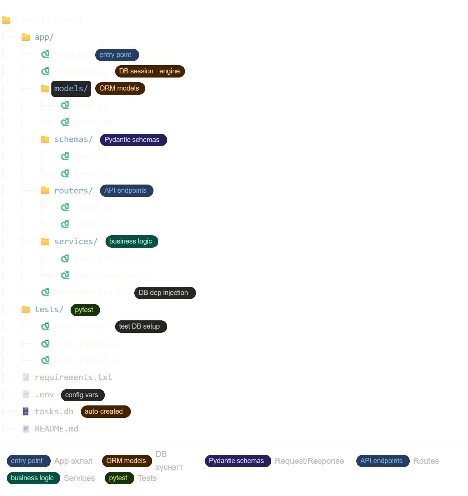

Data flow тайлбар:
Client HTTP request илгээхэд эхлээд Pydantic schema-аар автомат validate хийгдэнэ. Дараа нь Service layer бизнес логикийг (шүүлт, хугацаа шалгах, priority) гүйцэтгэж, SQLAlchemy ORM дамжуулан SQLite-руу query явуулна. Хариуг дахин Pydantic-аар serialize хийж JSON буцаана. tasks.db файл нэг л газар оршдог тул backup, deploy хоёулаа хялбар.

Тайлбар:
app/models/ — SQLAlchemy ORM class-ууд. Зөвхөн DB хүснэгтийн тодорхойлолт байна, бизнес логик байхгүй.
app/schemas/ — Pydantic model-ууд. TaskCreate (оролт), TaskOut (гаралт) гэж тусдаа байгаа нь чухал — DB model болон API response хэзээ ч ижил байх ёсгүй.
app/routers/ — FastAPI APIRouter ашиглан endpoint-уудыг тусгаарлана. main.py-д зөвхөн app.include_router(...) гэж нэмнэ.
app/services/ — Бүх бизнес логик энд байна. Router нь service-г дуудана, service нь DB-г дуудана. Router шууд DB-тэй харьцахгүй.
app/dependencies.py — get_db() функц нэг л газарт байвал session inject хаанаас ч хийж болно.
tests/conftest.py — In-memory SQLite (sqlite:///:memory:) тохируулдаг. Тест бүр цэвэр DB-тэй ажиллана, tasks.db файлд хэзээ ч хүрэхгүй.