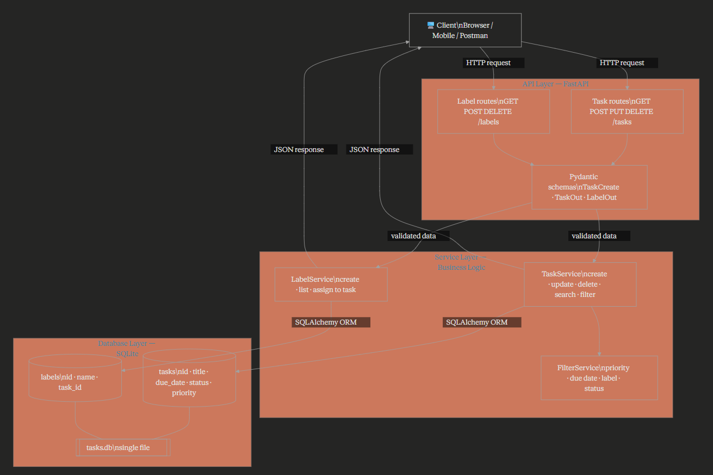

Data flow тайлбар:
Client HTTP request илгээхэд эхлээд Pydantic schema-аар автомат validate хийгдэнэ. Дараа нь Service layer бизнес логикийг (шүүлт, хугацаа шалгах, priority) гүйцэтгэж, SQLAlchemy ORM дамжуулан SQLite-руу query явуулна. Хариуг дахин Pydantic-аар serialize хийж JSON буцаана. tasks.db файл нэг л газар оршдог тул backup, deploy хоёулаа хялбар.